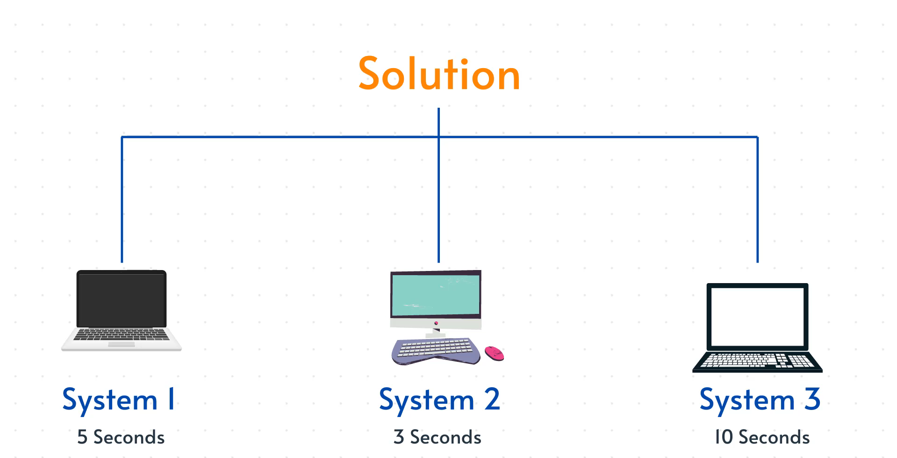
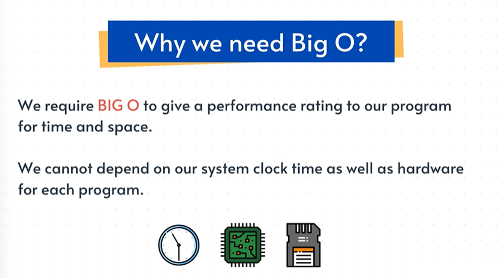

# **Why We Need Big-O Notation (and Why We Don’t Measure Time in Seconds)**

## **1. One Problem, Many Implementations**

- A single problem can be solved in multiple valid ways.
- Example: Finding the sum of the first *n* natural numbers (like *n = 100*).
- You might write:
    - A `for` loop
    - A `while` loop
- Both produce the same answer, but their “speed” seems different depending on where you run them.

---

## **2. Why Timing in Seconds Is Unreliable**

Even if the code is tiny, measuring execution time using your system clock is inconsistent.

### **Different machines = different results**

- Running the for-loop on your laptop → ~0.001 seconds
- Running the same code on an online server → ~0.00023 seconds
- Same code, different hardware = different timings.

### **Even the same machine gives unstable results**

- If you run the same program repeatedly, the time changes every run.
- It depends on:
    - RAM
    - CPU
    - Other processes running in the background
    - System load or “mood” of the machine

Because of all this, you can’t claim:

- “The for loop is faster” or
- “The while loop is faster”

Clock time just isn’t reliable.

---

## **3. Why We Use Big-O Instead**

- Hardware-dependent timing doesn’t give a fair comparison.
- Big-O gives us a **machine-independent** way to measure performance.

### **Big-O doesn’t care about seconds**

Instead, it cares about:

- **Number of steps**
- **Number of operations**
- **How the work grows as input grows**

It describes the **rate of growth** of your algorithm, not the actual running time.

### **Big-O gives a performance rating**

- Works for **time complexity**
- Works for **space complexity**
- Dependable across different machines

---

## **4. The Core Idea of Big-O**

- Big-O is a language to talk about algorithm efficiency.
- It focuses on:
    - *How much work the algorithm does*
    - *How it scales when input grows*
- It ignores:
    - Hardware
    - System load
    - Operating system
    - Tiny timing fluctuations

In short:

**Big-O tells you how your algorithm behaves, not how fast your computer is.**
