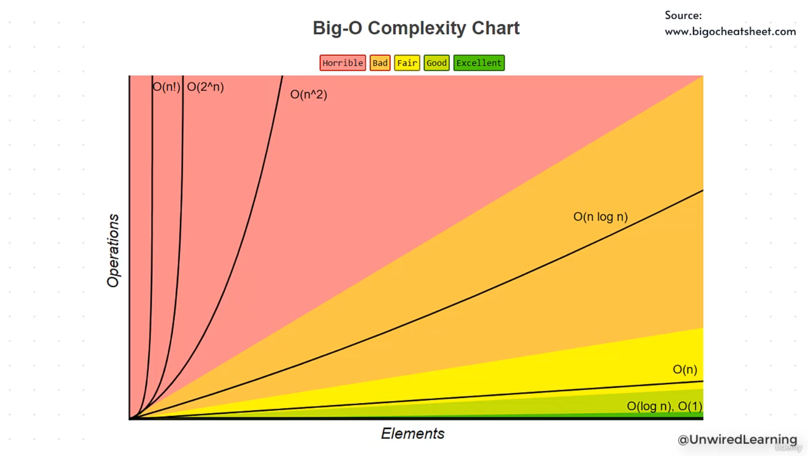

# **Understanding Big O(n) – Linear Time Complexity**

## **1. Recap: Why We Don’t Use Time in Seconds**

- System time varies based on hardware, RAM, CPU load, and random system behavior.
- Because of this, timing a program in seconds is unreliable.
- So we use **Big-O notation** as an alternate and consistent way to rate performance.

---

## **2. Big-O: A Better Rating System**

- Big-O focuses on:
    - **Number of operations**
    - **How input size affects performance**
- If Code A has 10 operations and Code B has 5 operations, Code B is objectively better — regardless of machine.
- Complexity analysis depends on both **operations** and **input size**.

---

## **3. Understanding the Graph**

- **X-axis → Input size** (number of elements)
- **Y-axis → Number of operations**
- Different algorithms create different curves.
- Some companies work with inputs of 50–100, others with millions.
- Complexity analysis is about **scalability** — how performance changes as input grows.

---

## **4. Example: Simple Search Function**

We have a list of names and we loop through it, checking if a target name exists.

### **How operations grow**

- If the list has 3 elements → 3 comparisons
- If the list has 4 elements → 4 comparisons
- If the list has 5 elements → 5 comparisons
- Even if the element is found early, the loop continues (in this example) and checks every element.
You can check the code in code.py

### **Pattern observed**

- **Number of inputs = number of operations**
- This is a **straight line** when plotted on a graph.

---

## **5. What Is Big O(n)?**

- When operations grow directly with input size, we call it:
    - **Linear time complexity**
    - **Big O(n)**

### **Key idea**

If:

- 2 inputs → 2 operations
- 5 inputs → 5 operations
- 10 inputs → 10 operations

…it’s a **linear pattern**, represented as **O(n)**.

### **Loops naturally follow O(n)**

- Most `for` loops and `while` loops run in linear time.
- In the example, the loop executes once for every element in the list, so it’s O(n).

---

## **6. Naming Inputs (n vs x)**

- `n` is just a standard variable used by the industry.
- You can call it `x`, `items`, or `size` — the concept remains the same.
- Big O(n) simply means **the complexity depends on the number of elements in the input**.

---

## **7. Takeaway**

- Big O(n) is the most common complexity you’ll see in real-world coding problems.
- If the number of operations matches the number of inputs, it’s **O(n)**.
- You’ll encounter many more complexities (O(1), O(n²), O(log n), etc.), and each has its own pattern.