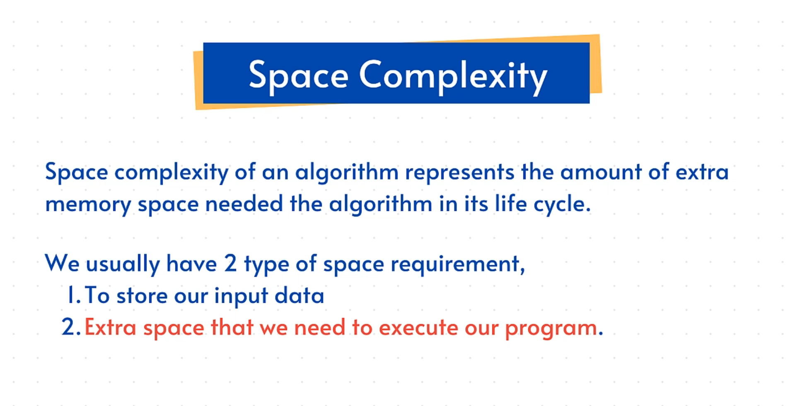

# **Understanding Space Complexity**

Time complexity tells you *how long* a program takes.

Space complexity tells you *how much extra memory* it needs.

The keyword here is **extra** memory — not the memory taken by the input itself. Inputs always need space, so we don’t count that.

We only measure what the program **adds on top of the input**.


---

## **1. What Is Space Complexity?**

In simple words:

> Space complexity = the extra memory a program needs to run.
> 

A more formal definition:

How much additional space must be allocated for variables, data structures, and temporary storage while the algorithm executes.

---

## **2. Example 1 — Constant Space → O(1)**

```python
items = [1, 2, 3, 4, 5, 6]

def calculate_cube(items):
    result = items[0] ** 3   # extra variable → O(1)
    print(result)

calculate_cube(items)

```

### Why is this O(1)?

- No matter how large the input list gets
    
    (6 items, 10 items, 1,000 items, 1 million…),
    
    the function only creates **one extra variable** — `result`.
    
- Extra memory used does **not grow** with input size.

So complexity stays:

### ✓ **O(1)** → constant space

---

## **3. Example 2 — Linear Space → O(n)**

```python
items = [1, 2, 3, 4, 5, 6]

def calculate_all_cubes(items):
    results = []                 # grows with input size

    for item in items:
        results.append(item ** 3)

    print(results)

```

### Why is this O(n)?

- The list `results` grows based on the number of input elements.
- If input has 6 elements → 6 results stored
- If input has 100 elements → 100 results stored
- If input has 1,000,000 elements → 1,000,000 stored

Extra memory **increases proportional to the input size**, so it’s:

### ✓ **O(n)** → linear space

---

## **4. How to Identify Space Complexity**

Ask one question:

> Does the amount of extra memory grow when the input grows?
> 
- If **no**, then → **O(1)**
- If **yes**, and it grows directly with input → **O(n)**
- If you had nested data structures, it could be **O(n²)** or more
    
    (but this lecture only focused on O(1) and O(n)).
    

---

## **5. Key Takeaways**

- We only measure **extra memory**, not the input itself.
- If you store just a few variables → **O(1)**
- If you store something for every element → **O(n)**
- Space complexity matters when working with:
    - Large datasets
    - Recursion
    - Creating new lists/arrays

This wraps up the basics of space complexity.