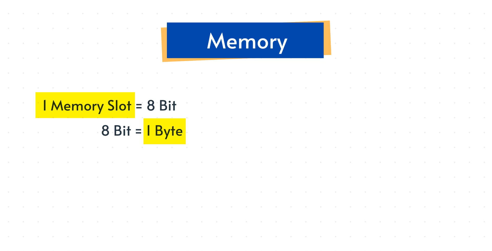

# **Memory Basics Explained**

## **1. Why Memory Matters**

Memory is one of the most fundamental concepts in computer science.

You won’t always be asked about it directly in interviews, but understanding memory helps you:

- visualize how data structures actually work
- understand how algorithms store and retrieve data
- reason about performance and space usage
- follow concepts like pointers, arrays, linked lists, etc.

Every program you write interacts with memory, so knowing the basics gives you stronger fundamentals.

---

## **2. What Is Memory?**

Memory is a large collection of **slots** used to store data.

### Key units:

- **1 bit** → smallest unit (0 or 1)
- **8 bits = 1 byte**
- **1 memory slot = 1 byte**

Memory is basically a long sequence of these slots.


---

## **3. 32-bit vs 64-bit Systems**

For simplicity, this lecture uses **32-bit architecture**.

In a 32-bit system:

- An `int` uses **32 bits**
- 32 bits = **4 bytes**
- So an integer occupies **4 memory slots**

Example:

```python
x = 2

```

This value will be stored across **4 consecutive bytes**.

---

## **4. Memory Canvas Visualization**

Think of memory as a horizontal row of boxes:

```
[ byte ][ byte ][ byte ][ byte ]

```

These 4 bytes together store one full integer.

When you store a value:

- The system allocates these bytes
- Combines them to form the value
- Assigns a **memory address**
    
    (memory addresses are written in **hexadecimal**)
    

Values inside the slots are stored in **binary**.

---

## **5. Example: Storing a List**

Say you have:

```python
vooc = [2, 3]

```

Each integer needs 4 bytes.

So memory stores:

- Value 2 → 4 bytes
- Value 3 → 4 bytes

Total: **8 consecutive bytes**

Each number is converted into binary.

If a number doesn’t fill all bits, zeros are added (padding).

This process is handled automatically by the computer — you don’t manually convert to binary — but it helps to know what happens behind the scenes.

---

## **6. Internal Ordering (Endianess)**

If a value doesn’t fill all bytes:

- The value is written first
- Remaining bytes are filled with zeros

This follows the system’s internal byte-ordering rules.

---

## **7. Storing Larger Values**

If the value needs more bits (for example, a very large integer):

- More bytes are used
- All 4 bytes together form the final value

This is why integers must always occupy **contiguous memory slots**.

---

## **8. Strings and ASCII**

Characters are stored using **ASCII codes**.

Examples:

- `'A'` → 65
- `'B'` → 66

A string is stored as a sequence of these ASCII values.

---

## **9. Pointers (Preview for Linked Lists)**

Memory slots can store **values**

or

Memory slots can store **addresses of other memory slots**.

Example (conceptually):

```
[2][3][pointer → next block]

```

If the current location doesn’t have enough space:

- Allocate a new memory block
- Store remaining values there
- Keep a pointer to link blocks

This is the foundation of **linked lists**.

---

## **10. Key Concepts to Remember**

- Memory is made of **slots**
- **1 slot = 8 bits = 1 byte**
- 32-bit integer → **4 bytes**
- Bytes must be **contiguous**
- Memory address → hexadecimal
- Stored value → binary
- Pointers can store addresses
- Memory access is extremely fast
- You always have **limited memory**, so efficient storage matters

---

## **11. What’s Next?**

Later lectures will show:

- How arrays live in memory
- How linked lists use pointers
- How stacks/queues store data
- Why space complexity matters
- How to reason about memory usage in algorithms

---

## **12. Summary**

Memory is the foundation behind all data structures.

Every value you store is translated into bits, placed into bytes, grouped into slots, and tracked using addresses.

Understanding this helps you visualize everything you build later.