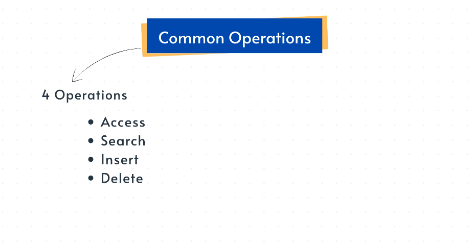

# Arrays — Common Operations and Time Complexities

Arrays are one of the most fundamental data structures.

Because elements are stored in contiguous memory with a fixed size, certain operations become extremely fast.

Below are the core operations you need to understand.

---

## 1. Accessing an Element

### Idea

To access an element at index `i`, the system calculates its memory address using:

address = start_address + i * element_size

```yaml

- `element_size = 4 bytes` on 32-bit systems
- `element_size = 8 bytes` on 64-bit systems

```
Because this calculation is constant, access time does not change with array size.

### Complexity

✅ **O(1) — Constant time**

### Why

The CPU always performs the same calculation, whether the array has 10 elements or 10 lakh elements.

---

## 2. Updating (Overwriting) an Element

### Idea

Updating follows the same process as accessing:

1. Compute the memory address
2. Jump directly to that location
3. Write the new value

No other elements are touched.

### Complexity

✅ **O(1) — Constant time**

---

## 3. Traversing the Array

### Idea

Traversing means visiting every element, usually with a loop.

If the array has `n` elements:

- You visit element 0
- Then element 1
- …
- Until element n-1

You must touch every element, so work scales with size.

### Complexity

✅ **O(n) — Linear time**

---

## 4. Important Notes

- Arrays store elements in **contiguous memory**.
- Every element has a **fixed width**, which enables constant-time access.
- Operations that involve touching every element (traversing, searching, shifting) become linear.
- Access and update remain constant because they rely only on address calculation.

---

## Summary Table

| Operation | Complexity |
| --- | --- |
| Access | O(1) |
| Update | O(1) |
| Traverse | O(n) |
| Search (unsorted) | O(n) |
| Insert/Delete | O(n) *(due to shifting)* |

---