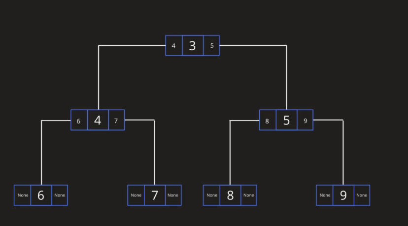
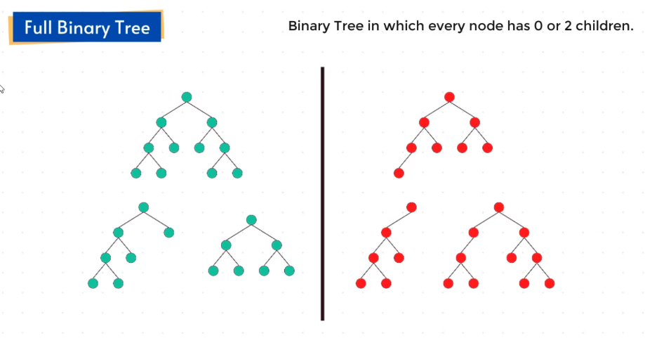
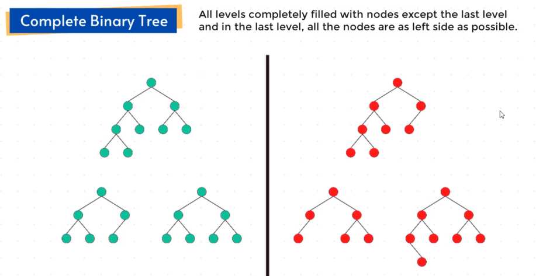
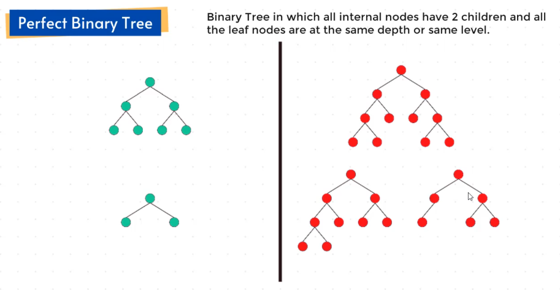
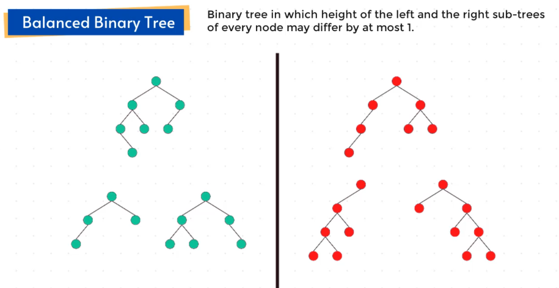
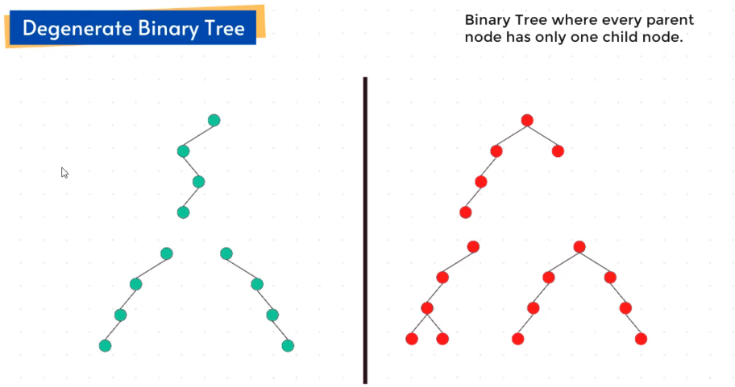

# Binary Trees — Notes

## 1. What Makes a Tree a Binary Tree?

* A binary tree is a tree where **each node can have at most two children**.
* Children are referred to as **left child** and **right child**.
* Valid: 0, 1, or 2 children.
* Invalid: A node having 3 children (not a binary tree).


---

## 2. Implementing a Binary Tree (Node Structure)

Each node stores three things:

1. **Data / key / value**
2. **Left child pointer**
3. **Right child pointer**

If a child doesn't exist → store **None / null**.

Example node:

```
Node:
- key
- left  → points to left child or None
- right → points to right child or None
```


---

## 3. Types of Binary Trees

There are **five major types**:

1. Full Binary Tree
2. Complete Binary Tree
3. Perfect Binary Tree
4. Balanced Binary Tree
5. Degenerate Binary Tree

Let’s break them down.

---

## 4. Full Binary Tree

* Every node has either **0 or 2 children**.
* A node having exactly 1 child violates the definition.

✔ Valid: nodes with 2 children or 0 children
✘ Invalid: nodes with only 1 child


---

## 5. Complete Binary Tree

* **All levels except the last** are completely filled.
* In the last level, nodes must be **left‑aligned**.

Rules:

* Level 0 → full
* Level 1 → full
* Level 2 → full
* Level 3 → may have gaps, but must fill from left to right.

Violations:

* If a node is missing in a position where a left‑aligned structure breaks.


---

## 6. Perfect Binary Tree

* All internal nodes have **two children**.
* All leaf nodes are at the **same level**.
* Entire tree is perfectly filled.

Example:

* If the tree has levels 0,1,2 → all levels must be fully filled.

Violations:

* Even a single missing child anywhere.


---

## 7. Balanced Binary Tree

* Based on **height difference** between left and right subtree of any node.
* Height difference ≤ **1** → balanced
* Height difference > 1 → unbalanced

Formula per node:

```
Balance Factor = height(left subtree) – height(right subtree)
```

Allowed values: **–1, 0, +1**

This doesn’t require perfect filling, just height balance.


---

## 8. Degenerate (or Skewed) Binary Tree

* Every node has **only one child**.
* The structure becomes like a **linked list**.
* Child can be left or right, but only one.

Examples:

* All left children
* All right children
* Alternating left → right → left → …

Violations:

* Any node having 2 children.


---

## 9. Summary Table

| Type       | Key Condition                                     |
| ---------- | ------------------------------------------------- |
| Full       | 0 or 2 children only                              |
| Complete   | All levels full except last; last is left‑aligned |
| Perfect    | Completely filled; all leaves on same level       |
| Balanced   | Height difference ≤ 1 at every node               |
| Degenerate | Every node has only 1 child                       |

---

